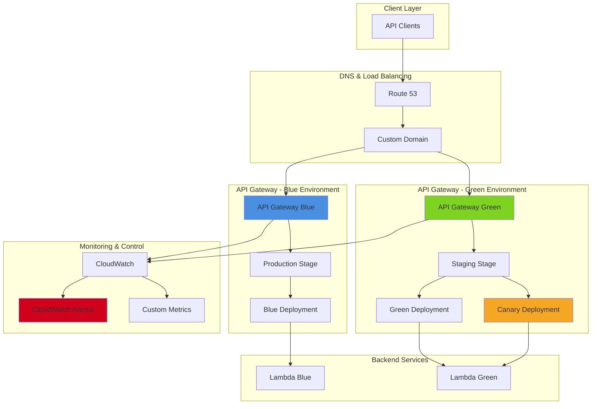

# Advanced API Deployment Strategies - Terraform

This repository contains only the Terraform code for the Advanced API Deployment Strategies project.

## Files

- `main.tf`
- `variables.tf`
- `outputs.tf`
- `versions.tf`
- `.terraform.lock.hcl`

## Usage

1. Initialize:
   terraform init
2. Plan:
   terraform plan
3. Apply:
   terraform apply

## Notes

- This repo intentionally excludes Terraform state files and generated artifacts.
- API testing from corporate networks may require proxy/firewall allowlisting for execute-api endpoints.

# Advanced API Gateway Deployment Strategies

## Problem

Enterprise API deployments require sophisticated release strategies to minimize business impact and ensure service reliability. Traditional all-at-once deployments create significant risks including service outages, performance degradation, and customer-facing errors. Organizations need controlled deployment mechanisms that enable gradual traffic shifting, automated rollback capabilities, and comprehensive monitoring to detect issues before they affect all users.

## Solution

Implement advanced API Gateway deployment patterns using blue-green and canary release strategies with automated traffic shifting and monitoring. This solution leverages API Gateway stages, weighted routing, and CloudWatch metrics to provide zero-downtime deployments with automated rollback capabilities based on error rates and latency thresholds.

## Architecture Diagram

## Prerequisites

1. AWS account with API Gateway, Lambda, CloudWatch, and Route 53 permissions
2. AWS CLI v2 installed and configured (or AWS CloudShell)
3. Understanding of API Gateway stages, deployments, and Lambda functions
4. Familiarity with DNS concepts and weighted routing
5. Estimated cost: $10-20 for testing (includes API Gateway calls, Lambda executions, Route 53 queries)

> **Note**: This recipe uses advanced API Gateway features including canary deployments and custom domain names which may incur additional charges.

